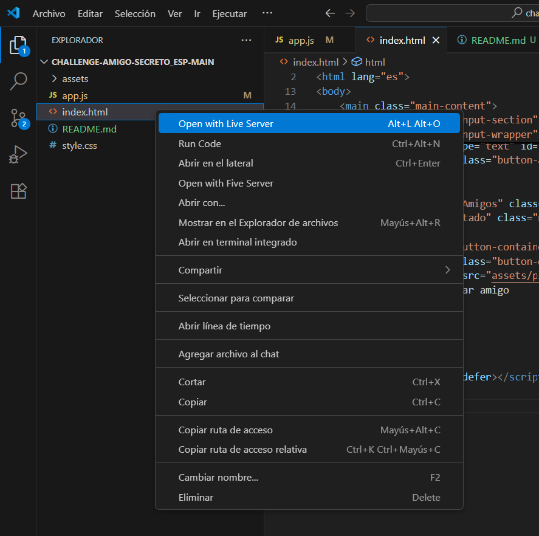
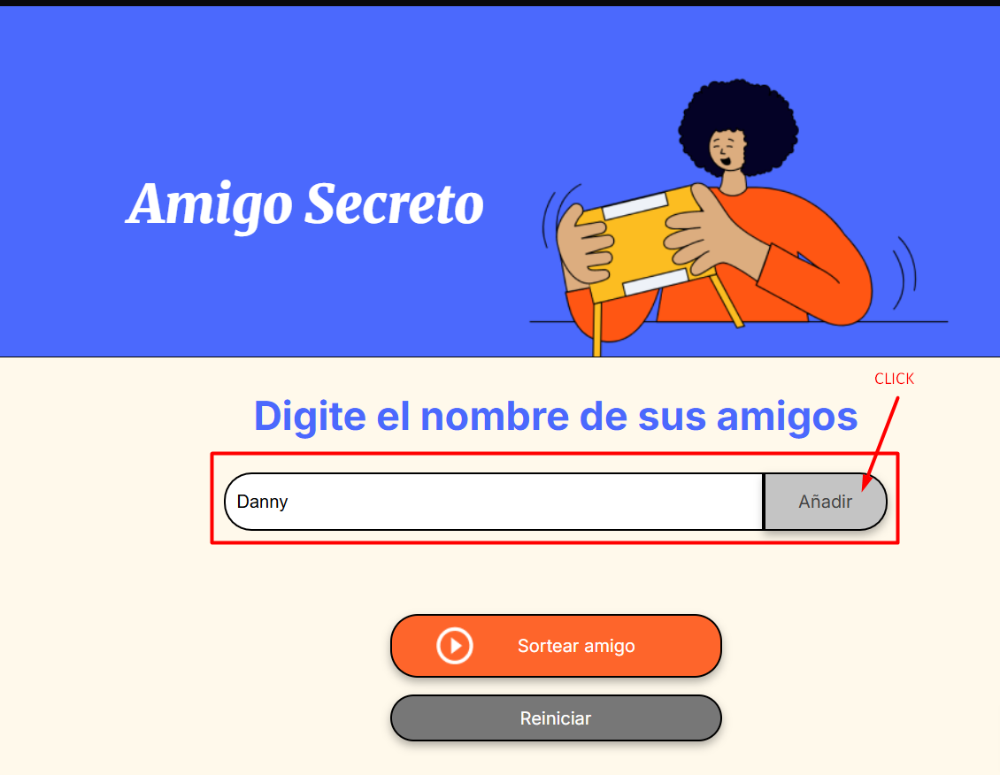
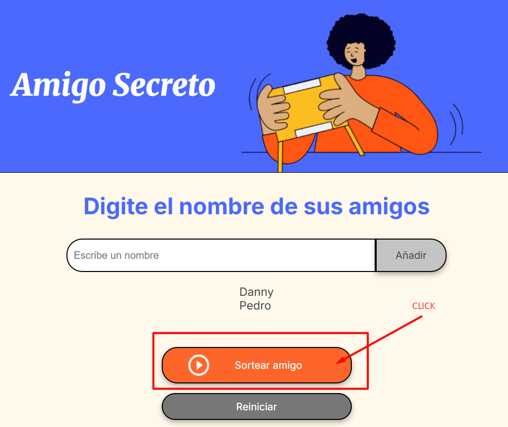
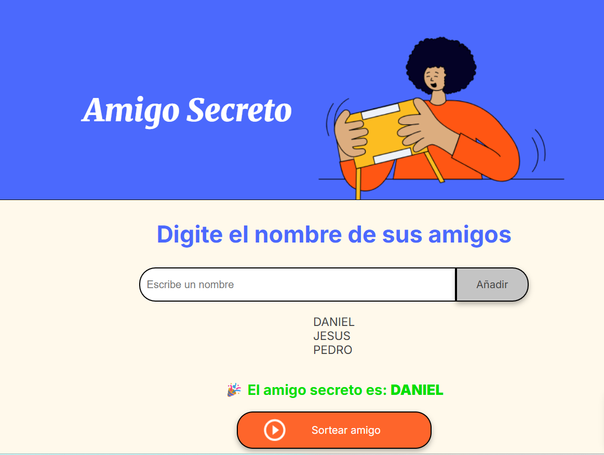
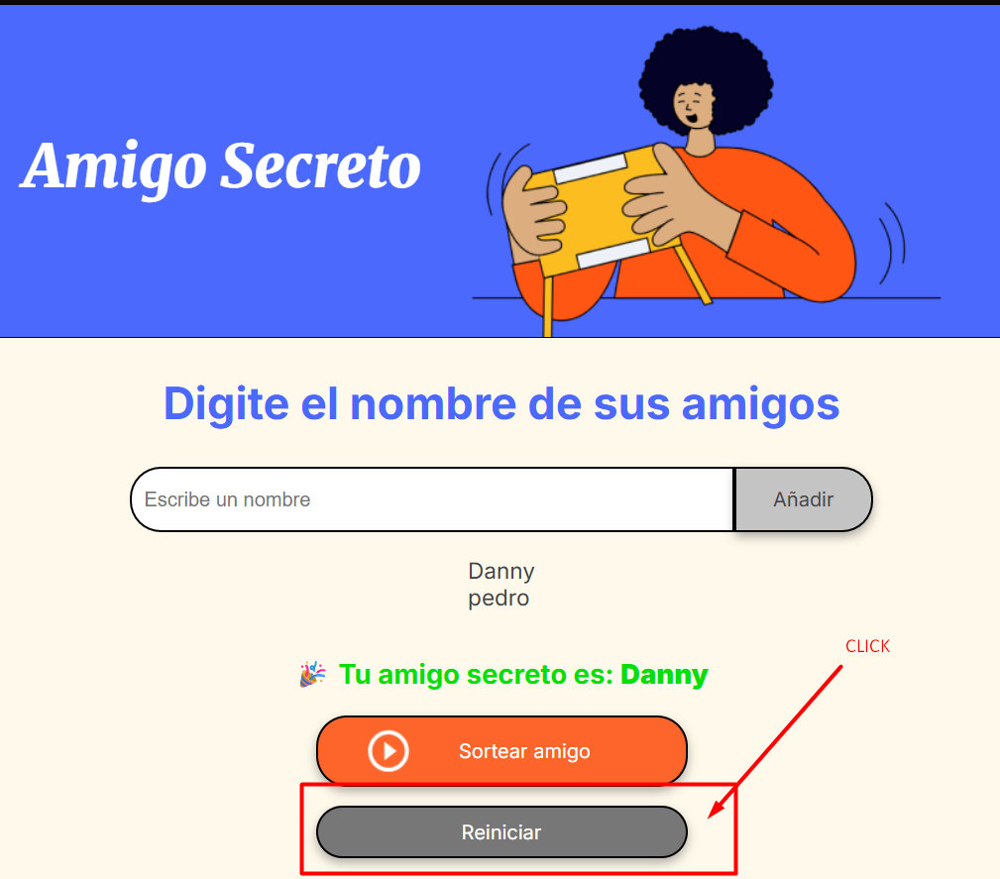

# 🎁 Amigo Secreto

Este es un proyecto donde puedes escribir los nombres de tus amigos y luego hacer un sorteo para ver quién es el **amigo secreto**.  

Lo hice con **HTML, CSS y JavaScript** para practicar lógica de programación.  

---

## ✨ Funciones
- Agregar nombres a una lista.
- Ver los nombres en pantalla.
- Sortear un amigo al azar.
- Mostrar el resultado en la página.
- Reiniciar 
---

## 🚀 Cómo usar

### 1️⃣ Abrir el proyecto
Abre el archivo `index.html` en tu navegador.  

---

### 2️⃣ Escribir nombres y añadir
Escribe los nombres y dale al botón **Añadir**.  

---

### 3️⃣ Sortear
Cuando tengas varios nombres, haz clic en **Sortear amigo**.  

---

### 4️⃣ Ver el resultado
¡Listo! Aparecerá el amigo secreto elegido.  

### 4️⃣ Reiniciar
Si quieres volver a jugar le das click en **Reiniciar**.  

---

## 👤 Autor
Hecho con 💻 y ☕ por [https://github.com/Daniela-2025].

## 🚀 Demo en vivo
Puedes probar el proyecto aquí:  
👉 [Amigo Secreto](https://daniela-2025.github.io/amigo-secreto/)

